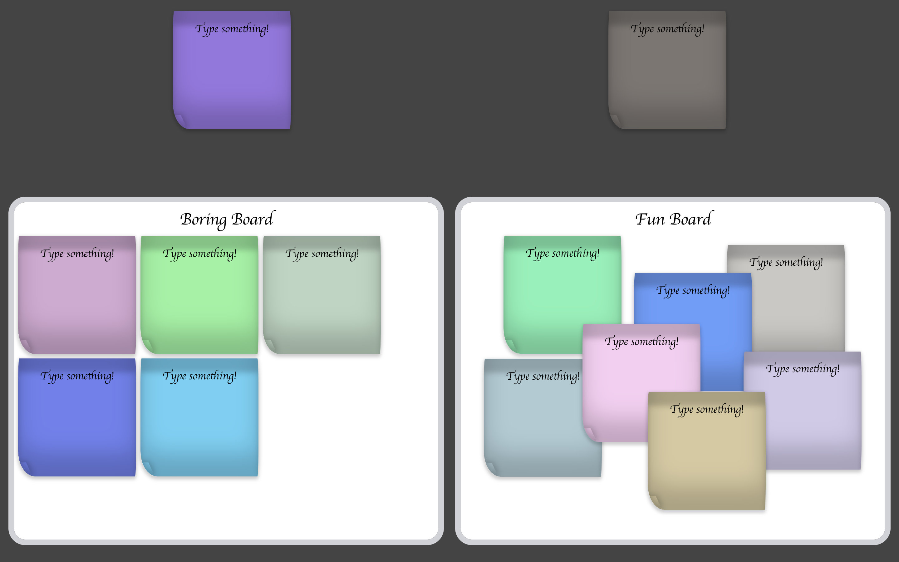

## Notes App with a custom-built Drag-and-Drop library

This is a drag-and-drop application for managing notes across different boards. Users can create, edit, and move notes seamlessly between boards.
All Drag-and-Drop logic is encapsulated in a separate library, allowing it to be easily transferred to other projects. Future plans include developing this library further and creating a standalone npm package.

## Live Demo

Check the [Live Demo](https://ark-web-dev.github.io/dnd-notes/)



## Stack


## Features

- Click on a note to edit its text.
- Drag notes to different boards.
- Create a new note by dragging an existing one (with a new random color).
- Left board: notes are arranged sequentially.
- Right board: notes are placed exactly where dropped.
- Move notes between boards.
- Notes dragged outside boards return to the notes stack.

## Drag-and-Drop Library Usage

#### Initialization

Initialize the library by calling `initDragAndDrop` and passing options:

```javascript
import { initDragAndDrop } from '@yourname/drag-and-drop';

initDragAndDrop({
  // options
});
```

#### Available Options

| Option                      | Type             | Default      | Description                                 | Callback Arguments                                                                        |
| --------------------------- | ---------------- | ------------ | ------------------------------------------- | ----------------------------------------------------------------------------------------- |
| `dragAreaSelector`          | string           | `.drag-area` | Selector for drag containers                |                                                                                           |
| `dragElementSelector`       | string           | `.draggable` | Selector for draggable elements             |                                                                                           |
| `dropAreaSelector`          | string           | `.drop-area` | Selector for drop areas                     |                                                                                           |
| `removeOnDropOutside`       | boolean          | false        | Remove element if dropped outside drop area |                                                                                           |
| `onPointerDownCallback`     | function \| null | null         | Callback at start of drag                   | ({dragElements, currentDragElement, dropAreas, currentDropArea, dragAreas, returnToArea}) |
| `onPointerUpCallback`       | function \| null | null         | Callback at end of drag                     | ({dragElements, currentDragElement, dropAreas, currentDropArea, dragAreas, returnToArea}) |
| `onPointerMoveCallback`     | function \| null | null         | Callback during drag movement               | ({dragElements, currentDragElement, dropAreas, currentDropArea, dragAreas, returnToArea}) |
| `onPointerMoveOnceCallback` | function \| null | null         | Callback on first drag movement             | ({dragElements, currentDragElement, dropAreas, currentDropArea, dragAreas, returnToArea}) |

#### All options are optional.

#### Example Usage

```javascript
initDragAndDrop();
```

#### Example with Options

```javascript
initDragAndDrop({
  dragAreaSelector: 'selector',
  dragElementSelector: 'selector',
  dropAreaSelector: 'selector',
  removeOnDropOutside: true,

  onPointerMoveOnceCallback: ({ currentDragElement }) => {
    if (something) currentDragElement.style.backgroundColor = 'red';
  },
});
```

## How to Run Locally

1. Install dependencies

   ```
   npm install
   # or
   yarn
   ```

2. Start the local server via Vite
   ```
   npm start dev
   # or
   yarn dev
   ```

## Conclusion

Our dnd-notes application demonstrates a robust implementation of a Drag-and-Drop system for managing notes, utilizing a custom-built library. This library can be easily integrated into other projects, and future enhancements aim to expand its capabilities and make it available as an npm package.
